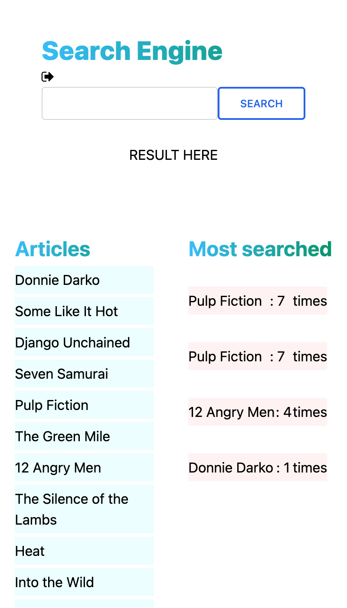

# REAL TIME SEARCH ENGINE

## Task Description

> To create a realtime search box, where users search articles, and then to have analytics that display what users  were searching for. 

- Page view:

> || mobile version| desktop version||
> |-|---------|----------|-|
> ||   |  | 

## Built With

- Ruby on Rails
- Git & GitHub

## Live Demo

[Live Demo Link]()

## Getting Started

To get a local copy for this project and running follow these simple example steps.

### Prerequisites

- You need to have git installed in your machine.
- A text editor or terminal
- A web browser to view output

### Setup

- To clone the repository run this command `https://github.com/joskalenda/search-box-rails.git`

## Test

For tracking linter errors locally you need to follow these steps:

- After cloning the project you need to run this command
  > bundle
   `This command will download all the dependencies of the project`

## Author

👤 **Jos Kalenda**

- [GitHub](https://github.com/joskalend)
- [Twitter](https://twitter.com/JosKalnda)
- [LinkedIn](https://www.linkedin.coin/jos-kalenda)

## 🤝 Contributing

Contributions, issues, and feature requests are welcome!

Feel free to check the [issues page](https://github.com/joskalenda/search-box-rails/issues).

## Show your support

Give a ⭐️ if you like this project!

## 📝 License

This project is MIT licensed.
